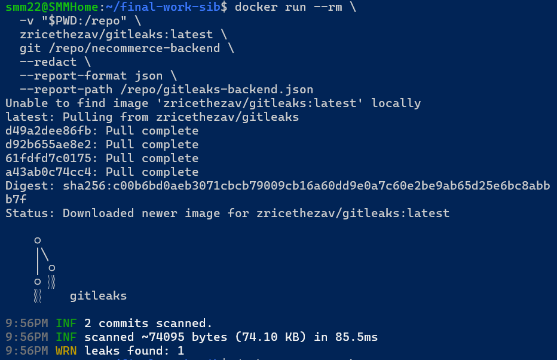
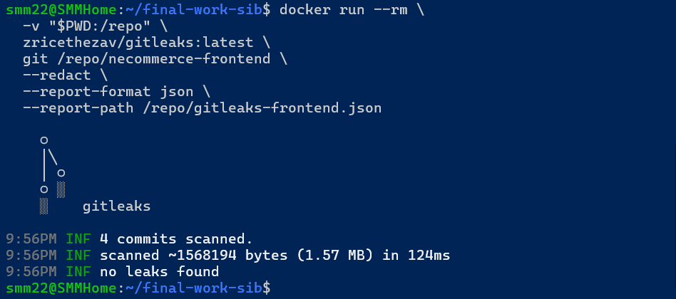
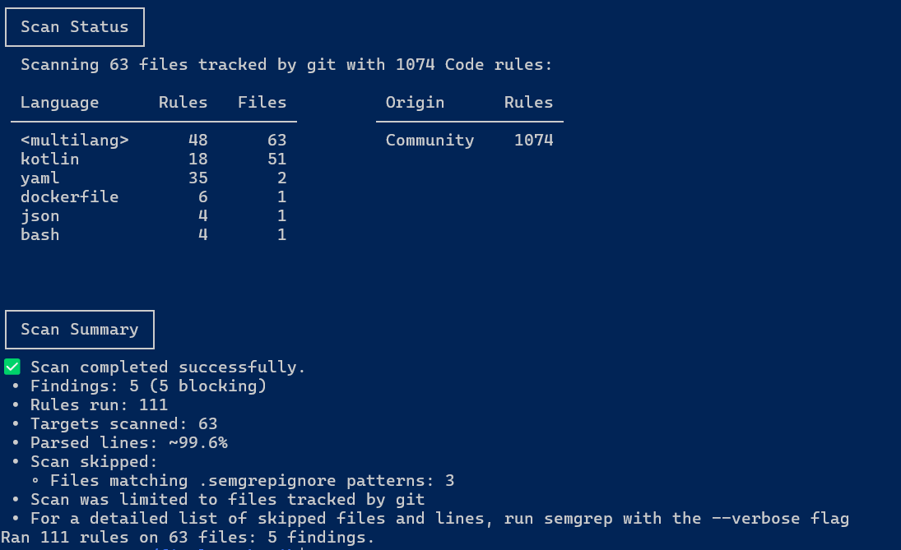
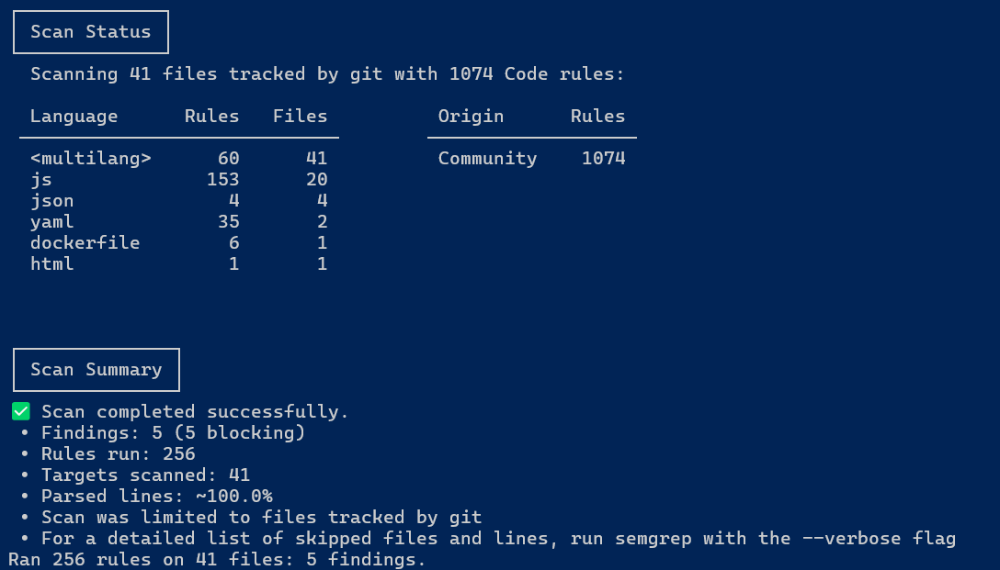
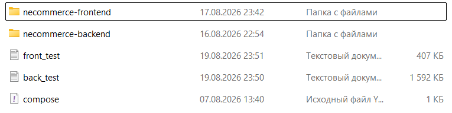
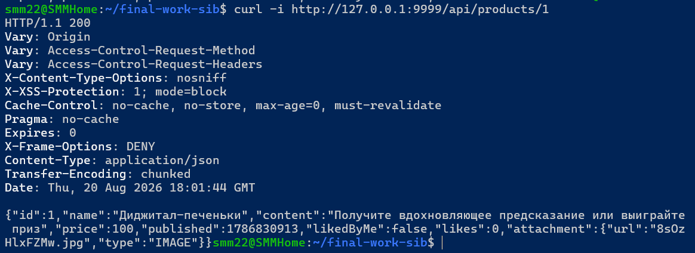
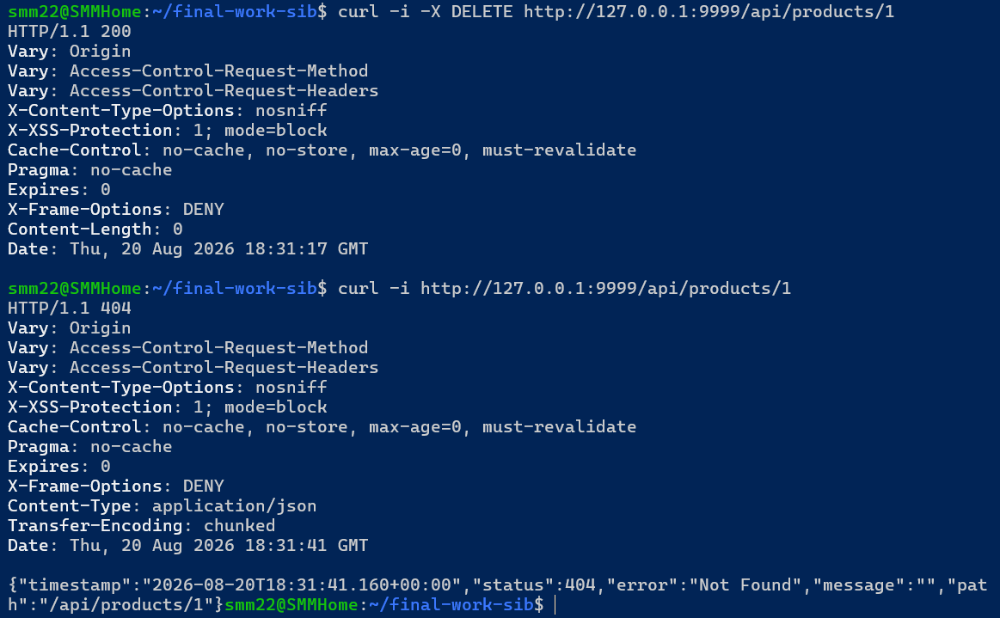

# E-Commerce Course Project — Information Security Specialist — Sergey Mikhalev

[Русская версия / Russian version](README-rus.md)

## Description

Company Y provides a comprehensive e-commerce web application called `Necommerce`. The company recently experienced a large-scale leak of data about its users and their purchases. The vulnerability through which the leak occurred appears to have been fixed.

The application itself is developed for Company Y by an external software-development contractor.

Company Y does not have its own information-security specialists, so you have been invited to perform a comprehensive analysis of the development process and test the application for other web vulnerabilities. No details about previously discovered and fixed vulnerabilities were provided: as a security professional, you are expected to perform the assessment from the beginning.

The contractor's developers provided the following source-code repositories:

* [Frontend](https://github.com/netology-code/necommerce-frontend).
* [Backend](https://github.com/netology-code/necommerce-backend).

**According to the developers:**

1. All development is performed in private GitHub repositories. *This is part of the course scenario; public repositories are provided for convenience.*
2. The code, dependencies, and containers are regularly checked using open tools:
   * [Dependabot](https://dependabot.com);
   * [GitHub Secret Scanning](https://docs.github.com/en/code-security/secret-scanning/introduction/about-secret-scanning);
   * [SonarQube](https://docs.sonarsource.com/sonarqube/latest/);
   * [Semgrep](https://semgrep.dev/);
   * [Trivy](https://trivy.dev/).
3. The code is covered by automated tests, including security-related tests such as handling invalid logins and passwords, and these tests are run on every push.
4. The developers are familiar with `OWASP Top 10`, and some of them also know `ASVS` and `WSTG`.
5. They follow strict development rules and do not allow pushes to `master` without Code Review by at least two people and successful automated checks.
6. After all checks pass, `Docker` images are built automatically and published to `GitHub Container Registry` for subsequent deployment to Production.
7. Reports produced by these tools are not publicly available. If necessary, the repositories can be forked/copied and the checks configured independently, or access can be requested from the course supervisor.
8. The services recommended by the course for completing the task include Gitea and GitVerse.

<details>
<summary><b>Instructions for starting the assessed services</b></summary>

The services are started with Docker Compose using the following configuration:

```yaml
version: '3.7'
services:
  backend:
    image: ghcr.io/netology-code/necommerce-backend
    ports:
      - 9999:9999
  frontend:
    image: ghcr.io/netology-code/necommerce-frontend
    environment:
      - API=http://backend:9999
      - MEDIA=http://backend:9999
    ports:
      - 8888:80
    depends_on:
      - backend
```

</details>

<details>
<summary><b>Course-project task</b></summary>

Perform a comprehensive assessment of the running application and its source code. The assessment should include the application code, dependencies, container build and configuration, and other relevant parts of the development and delivery process.

The project consists of three stages:

1. Planning.
2. Execution.
3. Report preparation.

</details>

### Work plan

<details>
<summary><b>Planning stage</b></summary>

A work plan must describe:

* what will be tested;
* how it will be tested: tools, approaches, regulatory documents, standards, and guidelines;
* an interval estimate, in hours, for each test, taking risks into account.

The supervisor acts as the Customer's representative and may adjust the scope of work by specifying which checks are unnecessary and which additional checks should be performed.

**Completion criterion:** the planned work has been documented and approved.

</details>

<details>
<summary><b>Execution stage</b></summary>

At this stage, the checks defined in the approved plan are performed. The testing process and results must be documented, the results must be analysed, and each result must have a conclusion and recommendations where required.

**Completion criterion:** the planned checks have been performed, the process and results are documented, the results have been analysed, and a general conclusion has been prepared.

</details>

<details>
<summary><b>Report preparation stage</b></summary>

The planning and execution results are combined into a single report. The report must contain a general conclusion and recommendations for improving the current development process. Recommendations must include references to their sources.

**Completion criterion:** a report containing the results of the work has been prepared.

</details>

## Solution

### Planning

**Status:** the plan was prepared and approved by the supervisor.

#### Objective and scope

The objective is to perform a risk-oriented security assessment of Necommerce following an incident involving leakage of user and order data, and to prepare reproducible conclusions and recommendations.

Assessment targets:

* source code of the [frontend](https://github.com/netology-code/necommerce-frontend) and [backend](https://github.com/netology-code/necommerce-backend);
* REST API, frontend, and user scenarios of the locally deployed application;
* dependencies and the generated software component inventory (SBOM);
* Dockerfile, Docker Compose, published images, and runtime configuration;
* publicly accessible GitHub Actions, tests, and development-process information;
* available configuration and reports from Dependabot, Secret Scanning, SonarQube/SonarCloud, Semgrep, and Trivy.

A full ASVS certification is not claimed. Within the available time, a risk-oriented selection of ASVS Level 1 requirements and relevant Level 2 requirements was used for authentication, authorization, orders, personal data, files, secrets, and logging.

#### Regulatory framework

This work does not constitute formal certification of the application against legislation or industry standards. Regulatory documents are used as sources of information-security requirements applicable to the assessed e-commerce service.

The following Russian regulatory requirements were considered in the original course assignment:

* Federal Law No. 152-FZ, *On Personal Data* — confidentiality and protection of users' personal data against unauthorized access, modification, copying, and disclosure. For this application it provides a basis for testing authentication, authorization, access control, API security, and logging.
* Law of the Russian Federation No. 2300-1, *On Consumer Rights Protection*, including distance-selling requirements — integrity and correctness of product, order, and customer information.
* Federal Law No. 54-FZ, *On the Use of Cash Register Equipment* — potentially applicable to production use where customer payments are processed. Cash-register integration is outside this assessment because the relevant functionality is not present in the test environment.
* Federal Law No. 161-FZ, *On the National Payment System* — relevant only if the application directly participates in payment processing.
* PCI DSS — considered as an industry standard whose applicability depends on whether payment-card data is processed. A full PCI DSS assessment is outside the scope of this work.

| Basis | Applicability | What is assessed |
|---|---|---|
| 152-FZ | Yes | Personal-data protection, access control, leaks, logs, API |
| Law No. 2300-1 | Yes | Integrity of products, prices, orders, and customer data |
| 54-FZ | Conditional | Payments/receipts, if implemented |
| 161-FZ | Conditional | If the application participates directly in payment operations |
| PCI DSS | Conditional; not legislation | If the application processes payment-card data |
| OWASP ASVS/WSTG | Yes; methodological basis | Specific technical requirements and test methods |
| CIS Docker Benchmark | Yes for the containerized environment | Container security |

Legislation defines **what must be protected**; standards help formulate technical requirements; WSTG and security tools define **how those requirements can be tested**.

#### Industry standards and product requirements

The assessment is primarily based on:

* OWASP ASVS;
* OWASP WSTG;
* OWASP Top 10;
* OWASP API Security Top 10;
* CIS Docker Benchmark;
* CWE;
* CVSS 4.0.

These sources define the technical baseline used for the checks described below.

#### Planned checks

| # | Area | Method | References | Expected result | Estimate, h |
|---|---|---|---|---|---:|
| 1 | Test environment and reproducibility | Start the supplied Compose environment; record versions, image IDs/digests, ports, runtime configuration, and initial logs | ASVS, CIS Docker Benchmark | Reproducible test-environment passport | 1–2 |
| 2 | Architecture and attack surface | Review frontend/backend source, routes, trust boundaries, containers, media and API paths | ASVS, WSTG | Architecture description and endpoint inventory | 1–2 |
| 3 | Repositories and SDLC | Review public GitHub Actions, tests, dependency/security automation and available branch controls | NIST SSDF, OWASP | Verified/blocked development-process controls | 1–2 |
| 4 | Secrets | Gitleaks, image inspection, Trivy secret scan; sanitize evidence | CWE, OWASP | Confirmed or rejected secret findings | 1–2 |
| 5 | Dependencies / SCA / SBOM | Trivy filesystem scan, `npm audit`, dependency inventory and triage | OWASP A06 | Dependency findings and component inventory | 2–3 |
| 6 | Source code | Semgrep CE `--config auto` plus manual review of security config, auth filters, controllers/services, objects, tokens, files, and logs | OWASP ASVS/WSTG, CWE | Sanitized SAST results and manually verified findings | 2–3 |
| 7 | Containers and configuration | Trivy image scan, Dockerfile/Compose review, runtime inspection | CIS Docker Benchmark | Container and runtime findings | 2–3 |
| 8 | Automated DAST | OWASP ZAP Baseline for frontend/API; limited active checks only against the local environment | OWASP WSTG | Sanitized ZAP results | 1–2 |
| 9 | Manual web/API testing | Negative tests for malformed input, HTTP methods, files, IDs, and error handling | OWASP WSTG | Reproducible API test evidence | 2–3 |
| 10 | Authentication, sessions and authorization | Matrix `anonymous/user A/user B/manager/admin × endpoint × object`; invalid credentials, tokens, BOLA/IDOR and role manipulation | WSTG, ASVS, API Security Top 10 | Actual-access matrix and bypass/denial evidence | 2–3 |
| 11 | Verification and risk assessment | Remove duplicates and false positives; reproduce findings; assign CWE, OWASP category, confidence, business impact and CVSS 4.0 where appropriate | CWE, OWASP, CVSS 4.0 | Register of confirmed findings with consistent priorities | 1–2 |
| 12 | Recommendations and execution trace | For every finding: sanitized evidence, risk, remediation, primary source and retest criterion; prepare coverage matrix | ASVS, WSTG, NIST SSDF | Final-report material and `PASS/FINDING/BLOCKED/NOT TESTED` coverage | 2–3 |

#### Dependencies, risks, and priorities

Dependencies: working Docker/Compose, access to GHCR and scanner databases, local copies of both source repositories at fixed commit SHAs, free ports `8888/9999`, test accounts for the required roles, and the ability to reset the H2 database. Verification of private GitHub controls requires access from the supervisor or exported reports.

Main planning risks:

* initial downloads of Dependency-Check, ZAP, or other scanner images/databases may consume a significant part of the available time; Trivy, `npm audit`, and Semgrep are the main local fallbacks;
* an SPA may not be completely covered by a spider, so routes are supplemented from source code, backend controllers, logs, and browser DevTools;
* mutable image tags do not prove correspondence with the current `master`; results are therefore tied to image digests where possible;
* without access to GitHub settings and private security reports, contractor claims are marked `BLOCKED`, not `PASS`;
* if time is limited, priority is: secrets and log leakage → authentication/authorization and order data → dependencies/images → configuration → remaining checks. Untested areas remain visible as `NOT TESTED`.

#### Planning completion criterion

The plan is considered prepared when the objective, method, tools, references, expected artifact, and interval estimate are defined for each work package and the boundaries and risks are agreed. The plan was approved by the supervisor acting as the Customer's representative; the planning-stage completion criterion was met.

---

### Execution

#### 1. Test-environment operability and reproducibility

**Assessment date:** 7 August 2026.

**Environment:** Docker Engine 27.1.1 and Docker Compose v2.29.1-desktop.1 in WSL Ubuntu 22.04; project `necommerce`.

**Evidence:** [`docker ps`](./evidence/01-stand/docker-ps.txt), sanitized `docker inspect` output for [frontend](./evidence/01-stand/docker-inspect-frontend.json) and [backend](./evidence/01-stand/docker-inspect-backend.json), [`curl` results](./evidence/01-stand/curl.txt), and application screenshots. The evidence set is described in [`evidence/01-stand`](./evidence/01-stand/README.md). Secret values and raw logs are not committed to the repository.

The large backend image was noted for subsequent image/layer analysis under item 7, **Containers and configuration**.

Application start page:


##### Running-environment passport

| Component | Container | Image | Local image ID | Process | State | Published port | Compose-network address |
|---|---|---|---|---|---|---|---|
| frontend | `a6ed302d40c2` | `ghcr.io/netology-code/necommerce-frontend` | `sha256:142c29187ec5…2bf50f0a` | nginx via `/docker-entrypoint.sh` | `running`, restart count `0`, OOMKilled `false` | `0.0.0.0:8888` → `80/tcp` | `172.18.0.3/16` |
| backend | `411cfba94fab` | `ghcr.io/netology-code/necommerce-backend` | `sha256:a68f8d87c946…c9359ea0` | `java -jar necommerce-1.0.jar` | `running`, restart count `0`, OOMKilled `false` | `0.0.0.0:9999` → `9999/tcp` | `172.18.0.2/16` |

Both containers are attached to `necommerce_default`, subnet `172.18.0.0/16`, gateway `172.18.0.1`. The frontend communicates with the backend using the Compose DNS name `backend:9999`, consistent with the `API` and `MEDIA` variables.

The `sha256` values in the table are **local image IDs**, not registry digests. The registry digests recorded for the running environment were:

* frontend — `ghcr.io/netology-code/necommerce-frontend@sha256:73a3e5af7e2d39a37c78a066fb92379ccaf79e32887a7189a26b71dd4e8628d5`;
* backend — `ghcr.io/netology-code/necommerce-backend@sha256:05ef6e8afa6452c8f2c8f1a0e3391310ffebea75019983ab6fbf54b4ae230862`.

##### Test results

| ID | Check | Actual result | Status |
|---|---|---|---|
| STAND-01 | Containers started | Both containers are `running`; no crash restarts or OOM termination recorded | `PASS` |
| STAND-02 | Frontend availability | `curl localhost:8888` returned the Necommerce HTML page; browser access confirmed | `PASS` |
| STAND-03 | Backend-process availability | `curl localhost:9999` returned the expected Spring Boot JSON `404` for the nonexistent `/` route, confirming that the HTTP server is available | `PASS` |
| STAND-04 | Backend application route | `GET http://127.0.0.1:9999/api/products` returned HTTP `200` | `PASS` |
| STAND-05 | Reproducible image identification | Local image IDs and registry digests were recorded, but Compose uses mutable image names without a tag/digest; another `pull` is not guaranteed to return identical bytes | `FINDING` |
| STAND-06 | Network-exposure restriction | Both ports are published on `0.0.0.0`; the frontend was also reachable through the WSL address, broader than the `127.0.0.1` allowlist adopted for active testing | `FINDING` |
| STAND-07 | Controlled restart readiness | No Docker healthcheck, restart policy, persistent volumes, or resource limits; root filesystem is writable | `FINDING` |
| STAND-08 | Startup logs | Backend logs contained DEBUG/TRACE/WARN/ERROR markers and matches for sensitive-field names. Preliminary review also identified administrative credentials being logged; values were deliberately not preserved. Frontend logs contained no WARN/ERROR entries in the reviewed sample | `FINDING` |

All STAND-01–STAND-08 checks were performed. `FINDING` means that a deviation from the adopted baseline was confirmed; it does not mean that the check itself was left unfinished.


Additional stand verification screenshots:


**Item 1 conclusion:** frontend and backend operability was confirmed; the current environment was identified by image IDs, registry digests, and Compose configuration. Full reproducibility is not guaranteed because mutable image references are used. Broad port publication and excessively detailed backend logging were also recorded. Overall status: `FINDING`.

---

#### 2. Architecture and attack surface

The assessed environment consists of two Docker containers:

* `frontend` — nginx, publishing the web interface on port `8888`;
* `backend` — Spring Boot, publishing the REST API on port `9999`.

Both containers share the `necommerce_default` Docker network. The frontend communicates with the backend using `backend:9999`.

The backend provides:

* REST API under `/api/**`;
* operations with users, products, comments, and orders;
* file and avatar uploads;
* media publication under `/media/**`;
* push-token functionality and related application services.

The endpoint inventory was derived from the backend controllers and recorded separately to keep the main report readable: [`evidence/02-attack-surface/endpoints.md`](./evidence/02-attack-surface/endpoints.md).

The main trust boundaries are: browser ↔ frontend; browser/frontend ↔ backend API; backend ↔ local data/storage; backend ↔ external integrations; build/CI ↔ GHCR/runtime image.

**Item 2 conclusion:** the application architecture, containers, exposed services, principal data flows, and API attack surface were identified. These results were used to scope subsequent source, dependency, container, DAST, and authorization checks.

---

#### 3. Repositories and SDLC

The public frontend and backend repositories and their GitHub Actions workflows were reviewed.

The CI jobs perform source checkout and Docker image build/push to GHCR. The public workflow configuration demonstrates that automated build and publication exist, but public repository data alone cannot confirm all of the contractor's claims about private branch rules, mandatory two-person review, private security reports, or whether every security check is a blocking gate.

Where the required GitHub settings or private reports were not accessible, the corresponding controls were classified as `BLOCKED`, not `PASS`.

Semgrep later identified mutable GitHub Actions references; these were consolidated into a single CI/CD supply-chain finding rather than counted as independent vulnerabilities for every workflow line.

Evidence: [`evidence/03-sdlc`](./evidence/03-sdlc/).

**Item 3 conclusion:** publicly visible CI/CD automation was confirmed, while claims requiring private GitHub settings/reports could not be independently verified. Overall status: `FINDING` / `BLOCKED` where access was unavailable.

---

#### 4. Secrets

Secret scanning was performed against the source repositories and container contents using Gitleaks and Trivy where applicable.

Gitleaks source-history scan results:

* backend — 2 commits scanned, **1 leak candidate**;



* frontend — 4 commits scanned, **no leaks found**.



The raw secret value was not copied into the report.

Trivy image inspection identified a Google Cloud service-account JSON credential in the backend image at:

```text
/src/fcm.json
```

The presence of the credential file was confirmed. Its validity and IAM permissions were deliberately **not** tested against the external Google Cloud environment. Therefore, the finding confirms secret material in the image but does not claim that the credential is currently active.

The dedicated frontend **secret scan** was not completed; the later Trivy vulnerability scan of the frontend image is a different check and does not replace it.

Evidence: [`evidence/04-secrets`](./evidence/04-secrets/).

**Item 4 conclusion:** secret material was confirmed in the backend source/image path. Sensitive values were sanitized. Overall status: `FINDING`.

---

#### 5. Dependencies, SCA and SBOM

Frontend dependencies were assessed using two independent SCA approaches.

`npm audit` reported:

```text
info:       0
low:        7
moderate: 116
high:      60
critical:  21
total:    204
```

Among direct dependencies, `axios` and `react-scripts` were reported with known security advisories. Critical findings included transitive packages such as `@babel/traverse`, `ejs`, `elliptic`, `form-data`, `immer`, `minimist`, `tar`, and others.

A Trivy filesystem scan reported 235 frontend findings: 20 Critical, 108 High, 87 Medium, and 20 Low.

These scanner counts are **not** interpreted as 204 or 235 independently exploitable application vulnerabilities. Direct/transitive status, runtime reachability, and applicability require triage.

Backend dependency/SBOM analysis was not completed to the same level during the available assessment window and remains explicitly visible as partial coverage.

Evidence: [`evidence/05-dependencies`](./evidence/05-dependencies/).

**Item 5 conclusion:** the frontend contains direct and transitive dependencies with known security advisories according to two independent SCA checks. Backend SCA/SBOM coverage is incomplete. Overall status: `FINDING / PARTIAL`.

---

#### 6. Source code

Semgrep CE was run with `--config auto` against both repositories, followed by manual review of security configuration, authentication filters, controllers/services, object access, tokens, file handling, and logging.

##### Backend



Backend Semgrep result:

* 63 files scanned;
* 111 rules run;
* 5 findings: 4 `WARNING`, 1 `ERROR`.

The four warnings concerned mutable GitHub Actions references. The error concerned the backend Dockerfile not defining a non-root `USER`.

##### Frontend



Frontend Semgrep result:

* 41 files scanned;
* 256 rules run;
* 5 `WARNING` findings, all related to mutable GitHub Actions references.

No Semgrep findings directly identified significant Kotlin or JavaScript application-logic vulnerabilities. Manual review, however, identified security-relevant candidates requiring runtime verification:

* global Spring Security configuration using `anyRequest().permitAll()`;
* missing object-level authorization candidate on `GET /api/orders/{id}`;
* missing role protection candidate on `DELETE /api/products/{id}`;
* token generation based on `java.util.Random(9999)` with a fixed seed;
* scheduled token invalidation containing an unimplemented `TODO`;
* administrative credentials written to logs;
* media validation using Apache Tika and server-generated filenames, but no obvious upload-size limit.

The authorization candidates were subsequently reproduced dynamically in items 9 and 10.

Evidence: [`evidence/06-source-code`](./evidence/06-source-code/), including [`manual-security-review.md`](./evidence/06-source-code/manual-security-review.md).

**Item 6 conclusion:** automated SAST did not reveal major application-code issues by itself, but manual source review identified several important candidates, including authorization weaknesses later confirmed dynamically. Overall status: `FINDING`.

---

#### 7. Containers and configuration

Published frontend and backend images and runtime configuration were assessed using Trivy and Docker inspection.

The full scanner output was about 2 MB, so only a concise summary is included in the report:



Trivy image results:

| Image/component | Critical | High | Medium | Low | Unknown |
|---|---:|---:|---:|---:|---:|
| Backend Debian packages | 53 | 217 | 188 | 68 | 12 |
| Backend Java/JAR components | 44 | 284 | 303 | 34 | — |
| Frontend Debian packages | 43 | 159 | 184 | 50 | 9 |

The backend runtime image also contains Gradle cache/build-time JAR files under `/root/.gradle/caches/...`, increasing image size and attack surface.

Runtime inspection additionally showed:

* backend process running as root;
* writable root filesystem;
* no capability drops;
* no `SecurityOpt` restrictions;
* no Docker healthcheck;
* service ports published on `0.0.0.0` / `::` rather than loopback only.

These scanner counts require package-level applicability and reachability triage; they are not treated as an equivalent number of exploitable vulnerabilities.

Evidence: [`evidence/07-containers`](./evidence/07-containers/README.md).

**Item 7 conclusion:** the images contain a large number of known vulnerable packages/components and several runtime-hardening weaknesses. Overall status: `FINDING`.

---

#### 8. Automated DAST

OWASP ZAP was used for automated dynamic testing.

##### Frontend

ZAP Baseline identified missing or weak HTTP-response protections, including:

* Content-Security-Policy not set;
* missing anti-clickjacking protection reported by ZAP;
* missing COEP/COOP/CORP headers;
* missing Permissions-Policy;
* `X-Content-Type-Options` missing on tested frontend responses;
* server-version disclosure (`nginx/1.19.8`).

##### Backend

A baseline scan against the backend root was initially unsuitable because `/` returned `404`. A ZAP Automation Framework `requestor` plan was therefore used to send requests to actual API endpoints:

* `/api/products`;
* `/api/products/1`;
* `/api/products/1/comments`.

The plan completed successfully and produced a passive-scan report. ZAP reported `Timestamp Disclosure - Unix`; manual verification showed that the value was the application's normal public `published` timestamp field. It was therefore classified as **false positive / not security relevant**.



Evidence: [`evidence/08-dast`](./evidence/08-dast/).

**Item 8 conclusion:** the frontend has several HTTP-header hardening findings; the backend passive result reviewed here did not reveal a significant vulnerability after false-positive verification. Overall package status: `FINDING`.

---

#### 9. Manual web/API negative testing

Manual API tests were performed using reproducible `curl` requests. The checks included invalid identifiers, malformed JSON, unsupported HTTP methods, unauthenticated file upload attempts, and authorization-sensitive operations.

Examples of expected error handling:

* `GET /api/products/999999` → `404 Not Found`;
* `GET /api/products/abc` → `400 Bad Request`;
* malformed registration JSON → `400 Bad Request`;
* unsupported `PUT /api/products/1` → `405 Method Not Allowed`;
* unauthenticated media upload → `403 Forbidden`.

The error responses did not expose stack traces, SQL queries, or internal exception details in the tested cases.

A significant authorization issue was reproduced during manual testing:

```http
DELETE /api/products/{id}
```

An unauthenticated request returned `HTTP 200`; a subsequent `GET` returned `404`, confirming that the product had actually been deleted.



Evidence: [`evidence/09-manual-api`](./evidence/09-manual-api/README.md).

**Item 9 conclusion:** general negative/error handling was mostly controlled in the tested scenarios, but an unauthenticated state-changing operation was confirmed. Coverage did not include every mapped endpoint. Overall status: `FINDING / PARTIAL`.

---

#### 10. Authentication, sessions, and authorization

A manual access-control matrix was tested for `anonymous`, `ROLE_USER`, `ROLE_MANAGER`, cross-user object access, and privileged operations. Two independent users (`userA` and `userB`) were used. Passwords and authentication-token values were not stored in evidence.

Correctly enforced examples:

* `GET /api/orders` without authentication → `403 Forbidden`;
* `GET /api/orders` with `ROLE_USER` → `403 Forbidden`;
* `GET /api/orders` with `ROLE_MANAGER` → `200 OK`;
* `GET /api/orders/my` with `ROLE_USER` → `200 OK`;
* `ROLE_USER` attempt to create a `ROLE_ADMIN` account → `403 Forbidden`;
* invalid authentication credentials → `400 Bad Request`.

However, object-level testing confirmed a serious access-control vulnerability.

An order belonging to `userA` was created and then requested directly by ID:

```http
GET /api/orders/1
```

The request returned `HTTP 200` **without an `Authorization` header** and disclosed order information including the owner's ID, name, and phone number.

The same order was then requested using `userB`'s token and again returned `HTTP 200` with `userA`'s order data.

This confirms **Broken Object Level Authorization (BOLA/IDOR)**: knowing or enumerating an order identifier is sufficient to retrieve another user's order, and authentication is not required for the vulnerable endpoint.

The previously identified product-deletion issue also confirms a function-level authorization failure: `DELETE /api/products/{id}` can be executed anonymously.

Evidence: [`evidence/10-authz`](./evidence/10-authz/README.md).

**Item 10 conclusion:** role-level access control works on some routes but is applied inconsistently. BOLA/IDOR and unauthenticated function-level access were dynamically reproduced. Overall status: `FINDING`.

---

#### 11. Verification and risk assessment

Automated and manual results were consolidated into a single register. Duplicate scanner messages were grouped, automated findings were manually reviewed, and false positives/informational observations were separated from confirmed vulnerabilities.

The following factors were considered when assigning priority:

* reproducibility in the local environment;
* authentication and privilege requirements;
* remote exploitability;
* confidentiality, integrity, and availability impact;
* exposure of personal or sensitive data;
* possible scale of impact;
* CWE and OWASP classification;
* CVSS 4.0 where a meaningful standalone score could be assigned.

##### Confirmed-findings register

| ID | Finding | Evidence | CWE / OWASP | Confidence | CVSS 4.0 / priority |
|---|---|---|---|---|---|
| F-01 | BOLA/IDOR when reading an order | `GET /api/orders/{id}` returns another user's order both to another `ROLE_USER` and anonymously; owner name and phone are disclosed | CWE-639 / OWASP API1:2023 | High | **8.7 High** — `CVSS:4.0/AV:N/AC:L/AT:N/PR:N/UI:N/VC:H/VI:N/VA:N/SC:N/SI:N/SA:N` |
| F-02 | Product deletion without authentication | Anonymous `DELETE /api/products/{id}` returns `200`; subsequent `GET` confirms deletion | CWE-862 / OWASP API5:2023 | High | **8.7 High** — `CVSS:4.0/AV:N/AC:L/AT:N/PR:N/UI:N/VC:N/VI:H/VA:N/SC:N/SI:N/SA:N` |
| F-03 | Administrative credentials written to logs | Backend startup logs include generated administrator login/password; confirmed by source review and runtime observation | CWE-532 / OWASP A09:2021 | High | **8.5 High** — `CVSS:4.0/AV:L/AC:L/AT:N/PR:L/UI:N/VC:H/VI:H/VA:H/SC:N/SI:N/SA:N` |
| F-04 | Weak authentication-token lifecycle | Fixed-seed token generation and incomplete scheduled invalidation identified in source | CWE-330 / CWE-613 / OWASP A07:2021 | Medium–High | High remediation priority; no standalone CVSS assigned |
| F-05 | Backend container runs as root | Semgrep/runtime review confirms no non-root `USER` | CWE-250 / OWASP A05:2021 | High | Medium |
| F-06 | Mutable GitHub Actions references | Semgrep identified action references by mutable tag/branch rather than full commit SHA | CWE-829 / OWASP A08:2021 | High | Medium |
| F-07 | Vulnerable frontend dependencies | `npm audit` and Trivy identified known High/Critical advisories; reachability requires separate triage | CWE-1104 / OWASP A06:2021 | High for presence | High remediation/triage priority |
| F-08 | Duplicate registration returns internal error | Re-registering an existing login produced `HTTP 500` instead of a controlled client error | CWE-755 / OWASP A05:2021 | High | Low |

A separate image-secret finding was also retained with **P0 pending owner validation**: a Google Cloud service-account credential file was found in the backend image. Its validity and IAM impact were intentionally not tested, so no artificial aggregate CVSS score was assigned.

##### Results not treated as standalone vulnerabilities

* ZAP `Timestamp Disclosure - Unix` was verified as the normal public `published` field and classified as a false positive / not security relevant.
* Repeated Semgrep warnings for mutable GitHub Actions references were consolidated into one supply-chain finding.
* SCA results for individual transitive packages were grouped as a dependency-management problem rather than treated as one application vulnerability per package.
* Expected `400`, `404`, and `405` responses without stack traces or internal details were considered correct error handling.
* Public user self-registration was not considered a vulnerability by itself: the server assigns `ROLE_USER`, and a normal user could not create `ROLE_ADMIN` in the tested flow.

Full register: [`evidence/11-risk-register`](./evidence/11-risk-register/README.md).

**Item 11 conclusion:** scanner results were deduplicated and verified, false positives were separated, and the most important confirmed vulnerabilities received CWE/OWASP classification and CVSS 4.0 vectors where appropriate. Overall status: `FINDING`.

---

#### 12. Recommendations and execution trace

The final recommendations are prioritized by confirmed technical and business impact.

##### P0 / immediate

1. Fix BOLA/IDOR on `/api/orders/{id}`: require authentication and enforce object ownership or an explicitly privileged role.
2. Protect all state-changing catalog operations, especially `DELETE /api/products/{id}`.
3. Stop logging credentials and authentication secrets; rotate potentially exposed administrative credentials.
4. Validate the service-account credential found in the backend image with its owner and, if active, revoke/rotate it; review IAM permissions and audit logs.
5. Replace predictable token generation with a cryptographically secure mechanism and implement token expiration/revocation.

##### P1 / high priority

1. Triage and update vulnerable dependencies and base images, taking runtime reachability/applicability into account.
2. Use smaller multi-stage runtime images and exclude Gradle caches/build artifacts.
3. Run application containers as non-root and apply runtime hardening: read-only filesystem where possible, capability drops, security options, resource limits, and healthchecks.
4. Pin GitHub Actions to full commit SHAs and make required security checks blocking.
5. Reduce DEBUG/TRACE logging and prevent sensitive values from entering logs.
6. Restrict service-port publication to the interfaces actually required.

##### P2 / hardening

1. Configure applicable browser security headers on the frontend.
2. Pin container images by immutable digest where deployment reproducibility is required.
3. Add negative regression tests for authentication, authorization, object ownership, file handling, and error processing.
4. Retest the confirmed BOLA/BFLA scenarios after remediation.

Primary references used for these recommendations include OWASP ASVS, OWASP WSTG, OWASP API Security Top 10, CIS Docker Benchmark, NIST SSDF, CWE, CVSS 4.0, and the relevant vendor documentation.

---

### Coverage and limitations

All 12 planned work packages were processed and received a documented status. `FINDING` indicates a completed check with a confirmed deviation; `BLOCKED` indicates that the required private settings or evidence were unavailable; `NOT TESTED` indicates an explicitly untested area rather than an assumed pass.

Known limitations:

* backend SCA and a complete SBOM were not completed;
* manual API and authorization testing did not cover every mapped API route;
* token lifecycle, rate limiting, authenticated upload scenarios, and some manager/admin combinations were not fully exercised dynamically;
* private GitHub repository settings, rulesets, and security reports were unavailable and therefore could not be verified;
* the validity and IAM permissions of the Google Cloud credential found in the backend image were intentionally not tested against the external cloud environment.

Evidence is organized by work package:

```text
evidence/
├── 01-stand/
├── 02-attack-surface/
├── 03-sdlc/
├── 04-secrets/
├── 05-dependencies/
├── 06-source-code/
├── 07-containers/
├── 08-dast/
├── 09-manual-api/
├── 10-authz/
└── 11-risk-register/
```

Sensitive values such as authentication tokens, passwords, and raw cloud credentials were deliberately excluded or redacted from committed evidence.

---

## General conclusion

The assessment identified several weaknesses across application authorization, secret handling, dependencies, container configuration, CI/CD, and logging.

The most important systemic problem is **inconsistent authorization enforcement**. Some endpoints correctly apply role restrictions, while individual object-level and function-level operations bypass those controls entirely.

The highest-impact dynamically reproduced issue is BOLA/IDOR on `GET /api/orders/{id}`: an anonymous user and another authenticated user can retrieve an order belonging to someone else, including owner-related personal data. This directly corresponds to the data-leak risk described in the original course scenario.

A second serious authorization issue allows unauthenticated deletion of products through `DELETE /api/products/{id}`, affecting catalog integrity.

Additional significant risks include administrative credentials in logs, weak token-generation/lifecycle logic, secret material embedded in the backend image, vulnerable dependencies and base-image components, root container execution, mutable CI action references, and insufficient runtime/browser hardening.

At the same time, the assessment also confirmed correctly enforced controls in a number of scenarios: protected order-list routes reject anonymous and normal users as expected, manager access works where intended, normal users cannot create administrator accounts, malformed requests generally return controlled client errors, and no stack traces or SQL details were observed in the tested error responses.

The assessment therefore does not conclude that the application's security controls are completely absent. Rather, the main problem is that they are **incomplete and inconsistently applied**, particularly at object and function level. The first remediation priority should be authorization and credential/secret handling, followed by dependency/container hardening and CI/CD improvements.

The full Russian-language course report is preserved in [`README-rus.md`](README-rus.md).