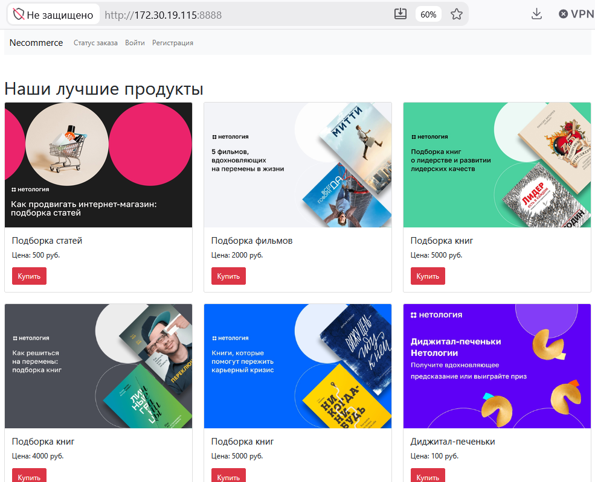
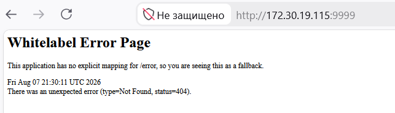
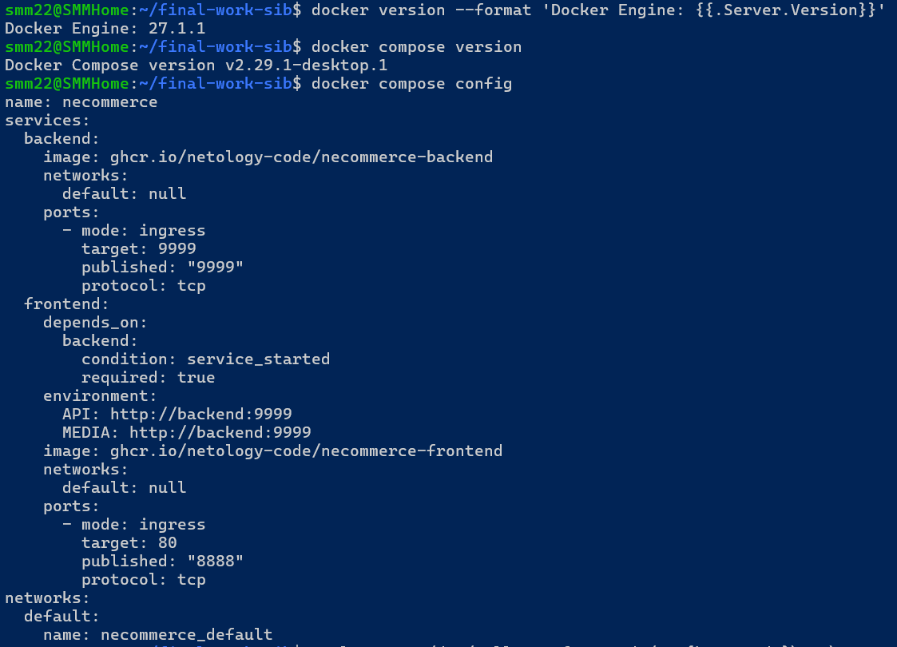
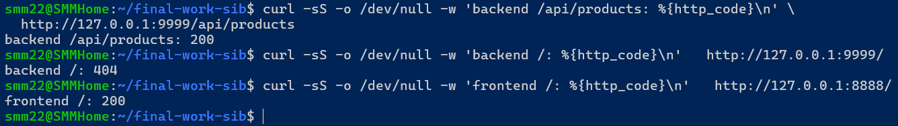

# Курсовая работа «E-Commerce». Профессия «Специалист по информационной безопасности»- Михалёв Сергей


## Описание

Компания Y предоставляет комплексное веб-приложение в сфере электронной коммерции `Necommerce`. Компания недавно столкнулась с массовой утечкой данных о своих пользователях и их покупках. «Брешь», через которую произошла утечка, вроде как устранили.

Саму разработку приложения компания Y заказывает у подрядчика — фирмы-разработчика.

Своих специалистов по информационной безопасности у компании Y нет, поэтому вас пригласили провести комплексный анализ процесса разработки и протестировать на наличие других веб-уязвимостей. Детали по найденным и исправленным уязвимостям не дали, так как вы профессионал и должны проверить всё с начала.

Разработчики со стороны подрядчика также максимально пошли вам на встречу и предоставили исчерпывающую информацию о приложении — две ссылки на репозитории с кодом:
* [Frontend](https://github.com/netology-code/necommerce-frontend).
* [Backend](https://github.com/netology-code/necommerce-backend).

**По словам разработчиков:**
1. Вся разработка ведётся в приватных репозиториях в GitHub. *Это легенда, для удобства мы вам дали открытые репозитории*.

2. Весь код, а также зависимости и контейнеры, регулярно  проходят проверку открытыми инструментами:
    * [Dependabot](https://dependabot.com).
    * [GitHub Secret Scaning](https://docs.github.com/ru/code-security/secret-scanning/about-secret-scanning)
    * [SonarQube](https://docs.sonarsource.com/sonarqube/latest/)
    * [Semgrep](https://semgrep.dev/)
    * [Trivy](https://trivy.dev/)
    
3. Сам код покрыт автоматическими тестами, включая проверку механизмов безопасности (отработка неверных логинов и паролей), которые регулярно прогоняются при каждом push в репозиторий.

4. Разработчики прекрасно знакомы с `OWASP Top 10`, а некоторые даже с `ASVS` и `WSTG`.

5. Они придерживаются строгих правил разработки и не разрешают отправлять `push` в `master` без соответствующего `Code Review` как минимум двух человек и прохождения автоматизированных проверок.

6. После прохождения всех проверок автоматически собираются образы `Docker` и публикуются в `GitHub Container Registry` для дальнейшего разворачивания в Production.
7. Отчёты этих инструментов скрыты из публичного доступа. При желании вы можете `Fork`'нуть/скопировать к себе репозиторий и самостоятельно настроить репозиторий, либо обратиться к руководителю курса, чтобы он вас добавил временно в репозиторий для просмотра настроек инструментов.
8. Рекомендуемые сервисы для выполнения задач: [Gitea](https://about.gitea.com/), [Gitverse](https://gitverse.ru/).

<details>

<summary><b>Инструкция по запуску исследуемых сервисов</b></summary>


Для запуска сервисов используется Docker-compose, со следующим конфигурационным файлом:
**docker-сompose.yml**:

```
version: '3.7'
services:
  backend:
    image: ghcr.io/netology-code/necommerce-backend
    ports:
      - 9999:9999
  frontend:
    image: ghcr.io/netology-code/necommerce-frontend
    environment:
      - API=http://backend:9999
      - MEDIA=http://backend:9999
    ports:
      - 8888:80
    depends_on:
      - backend
```

</details>

<details>
<summary><b>Задача курсовой работы</b></summary>


Выполнить комплексное исследование функционирующего приложения и исходных кодов. Обратите внимание на код приложения, всё ли в порядке с зависимостями, верно ли собираются контейнеры и т.д. Для этого выделяются следующие этапы курсовой работы:

1. Планирование.
2. Выполнение.
3. Подготовка отчёта.

</details>

### План выполнения

<details>
<summary><b>Этап планирования</b></summary>

После начала работы над дипломом в течение установленного срока вы должны сдать руководителю план работ, в котором описано:

* что вы будете проверять;
* как вы будете это проверять: инструменты, подходы, используемые нормативные документы, стандарты или руководства;
* интервальная оценка с учётом рисков в часах на каждую из проверок.

Руководитель выступает в роли представителя со стороны Заказчика, поэтому именно он определяет правила выполнения и сдачи работ. Если его требования расходятся с указанными в этом документе, то приоритет имеют требования руководителя.

Руководитель может скорректировать ваш план работ, указав:

* какие работы делать не нужно;
* какие работы нужно сделать дополнительно.

**Критерий выполнения:** составлен и утверждён план предстоящих работ (с учётом вышеизложенных рекомендаций по составлению плана работ).

</details>

<details>
<summary><b>Этап выполнения</b></summary>

На этом этапе вы выполняете работу. Можете консультироваться с руководителем по вопросам, требующих уточнения. Допустим: является ли данная функциональность запланированной или нет.

**Критерий выполнения:** 
проведены запланированные проверки в соответствии с планом работ;
процесс проверок хорошо описан, а результаты задокументироованы;
проведён анализ полученных результатов;
по каждому из полученных результатов приведено заключение (указаны рекомендации если требуется), с резюмированием в виде общего вывода.

**Срок выполнения**: согласовывается с руководителем, но не более 7 дней с момента утверждения плана.

</details>

<details>
<summary><b>Этап подготовки отчёта</b></summary>

Полученные в ходе планирования и выполнения результаты оформляются в виде единого документа — отчёта.

В отчёте формируется общее заключение по результатам выполненных работ, включающее рекомендации по улучшению текущего процесса разработки.
При указании рекомендаций обязательно должна быть ссылка на источник рекомендаций.

Шаблон, который можно использовать для оформления отчёта приведён в файле **template.docx**. Скачать шаблон можно по [ссылке](https://u.netology.ru/backend/uploads/lms/content_assets/file/12045/template__2_.docx).

**Критерий выполнения:**
сформирован отчёт о результатах выполненных работ.

**Срок выполнения**: согласовывается с руководителем, но не более 3 дней с момента завершения этапа выполнение.

</details>

## Решение

### Планирование

**Статус:** план подготовлен по результатам изучения задания и предварительной проверки локального стенда. Для формального завершения этапа требуется утверждение руководителя.

#### Цель и границы работ

Цель — провести риск-ориентированную проверку безопасности Necommerce после инцидента с утечкой данных пользователей и заказов и подготовить воспроизводимые выводы и рекомендации.

Объекты проверки:

* исходный код [frontend](https://github.com/netology-code/necommerce-frontend) и [backend](https://github.com/netology-code/necommerce-backend);
* REST API, frontend и пользовательские сценарии локально запущенного приложения;
* зависимости и формируемый перечень компонентов (SBOM);
* Dockerfile, Docker Compose, опубликованные образы и их runtime-конфигурация;
* публично доступная часть GitHub Actions, тестов и процесса разработки;
* доступные настройки и отчёты Dependabot, Secret Scanning, SonarQube/SonarCloud, Semgrep и Trivy.

Полная сертификация приложения по ASVS не заявляется: в отведённое время выполняется риск-ориентированная выборка требований ASVS уровня L1 и релевантных требований L2 для аутентификации, авторизации, заказов, персональных данных, файлов, секретов и журналирования.

#### Нормативно-правовая база

В рамках данной работы не проводится формальная сертификация приложения на соответствие требованиям законодательства или отраслевых стандартов. Нормативные документы используются как источник требований информационной безопасности, применимых к исследуемому сервису электронной коммерции.

К основным применимым нормативным требованиям относятся:

* Федеральный закон № 152-ФЗ «О персональных данных» — в части обеспечения конфиденциальности и защиты персональных данных пользователей от неправомерного доступа, изменения, копирования и распространения. Для исследуемого приложения это обосновывает проверки механизмов аутентификации, авторизации, контроля доступа, API и журналирования.
* Закон РФ № 2300-1 «О защите прав потребителей», в частности требования дистанционной торговли, — в части обеспечения корректности и целостности информации о товарах, заказах и данных покупателя.
* Федеральный закон № 54-ФЗ «О применении контрольно-кассовой техники» — потенциально применим к промышленной эксплуатации сервиса при реализации расчётов с покупателями. Проверка интеграции с ККТ в область данной работы не входит, поскольку соответствующая функциональность в исследуемом стенде не представлена.
* Федеральный закон № 161-ФЗ «О национальной платёжной системе» учитывается только при непосредственном участии приложения в обработке платёжных операций.
* PCI DSS рассматривается как отраслевой стандарт, применимость которого зависит от того, обрабатывает ли приложение данные платёжных карт. Полная проверка соответствия PCI DSS в область данной работы не входит.

| Основание	| Применимость	| Что проверяем |
|------|------|------|
|152-ФЗ	| Да	| защита ПДн, контроль доступа, утечки, логи, API |
|Закон № 2300-1	| Да	| целостность товара, цены, заказа и данных покупателя|
|54-ФЗ	| Условно	| платёж/чек, если такая функциональность реализована |
|161-ФЗ	| Условно	| если приложение само участвует в платёжных операциях |
|PCI DSS	| Условно, не закон |	если приложение обрабатывает данные банковских карт |
|OWASP ASVS/WSTG	| Да, методическая база |	конкретные технические требования и методы проверки |
|CIS Docker Benchmark	| Да для контейнерного стенда	| безопасность контейнеров |


Законодательство говорит, что необходимо защищать; стандарты определяют, как сформулировать технические требования; WSTG и инструменты определяют, как эти требования проверить.

Для данной работы В качестве нормативной базы приняты 152-ФЗ, 54-ФЗ и 2300-1 о защите прав потребителей.

#### Отраслевые стандарты и требования продукта

Буду ориентироваться на 

* OWASP ASVS
* OWASP WSTG
* OWASP Top 10
* CIS Docker Benchmark

именно они определяют что проверять.


#### Результаты предварительной проверки стенда

5 августа 2026 года приложение развёрнуто из `docker-compose.yml` в Docker Desktop 4.33.1 (Engine 27.1.1, Compose 2.29.1):

* frontend доступен на `http://127.0.0.1:8888`, backend — на `http://127.0.0.1:9999`;
* `GET /`, прямой `GET /api/products` и запрос API через frontend возвращают HTTP 200;
* зафиксированы digest образов backend `sha256:05ef6e8a…230862` и frontend `sha256:73a3e5af…8628d5`;
* холодный запуск backend занял около 53 секунд;
* в Compose отсутствуют healthcheck и постоянные тома, а образы заданы изменяемыми тегами;
* backend запускается с профилем по умолчанию от пользователя `root`; журналы уровня `DEBUG`/`TRACE` раскрывают маршруты и данные запросов;
* при старте backend записывает в журнал сгенерированные учётные данные администратора. Значение пароля намеренно не переносится в репозиторий.

Последние пункты являются сигналами для обязательной проверки конфигурации и журналирования, но окончательный статус уязвимости будет присвоен только после воспроизведения и оценки влияния.

#### Правила безопасного тестирования и фиксации результатов

* Активные проверки разрешены только для локального стенда `127.0.0.1:8888` и `127.0.0.1:9999`; публичные ресурсы используются только как источники кода и документации.
* Используются только тестовые учётные записи и данные. DoS, нагрузочные проверки, массовый подбор паролей, социальная инженерия и необратимые действия исключены.
* Для проверки аутентификации и авторизации создаются отдельные учётные записи `user A`, `user B`, `manager` и `admin`; состояние H2 восстанавливается пересозданием контейнеров.
* Найденные ключи, токены и пароли маскируются и не проверяются обращением к сторонним сервисам.
* Для каждого теста фиксируются ID, commit SHA или digest цели, версия инструмента, команда/шаги, ожидаемый и фактический результат, время и безопасное доказательство.
* Статус каждого теста: `PASS`, `FINDING`, `BLOCKED` или `NOT TESTED`. Недоступные закрытые настройки GitHub и отчёты нельзя считать успешно проверенными.
* Активная проверка прекращается при выходе запроса за локальный allowlist, нестабильности стенда, риске повреждения данных или появлении неконтролируемой нагрузки.

#### Методическая и нормативная база

* [OWASP ASVS 5.0.0](https://owasp.org/www-project-application-security-verification-standard/) — источник проверяемых требований к техническим средствам защиты;
* [OWASP WSTG 4.2](https://owasp.org/www-project-web-security-testing-guide/v42/) — стабильное руководство по ручному тестированию web-приложений;
* [OWASP API Security Top 10:2023](https://owasp.org/API-Security/editions/2023/en/0x00-header/) — риски API, включая BOLA и нарушения аутентификации/авторизации;
* [OWASP Top 10:2025](https://owasp.org/Top10/) — классификация рисков web-приложений;
* [NIST SP 800-218 SSDF 1.1](https://csrc.nist.gov/pubs/sp/800/218/final), [OWASP SAMM](https://owaspsamm.org/model/) и [SLSA 1.2](https://slsa.dev/spec/v1.2/) — анализ SDLC, CI/CD и цепочки поставки;
* [Docker build best practices](https://docs.docker.com/build/building/best-practices/) и [CIS Docker Benchmark](https://www.cisecurity.org/benchmark/docker) — сборка и защита контейнеров;
* [CWE](https://cwe.mitre.org/) и [CVSS 4.0](https://www.first.org/cvss/specification-document) — классификация и оценка серьёзности; вместе с оценкой сохраняется полный vector string.

#### Оценка этапа планирования


* Определение scope, ограничений, допустимой интенсивности и критериев завершения 
* Инвентаризация стека, репозиториев и запущенных артефактов 
* Составление карты данных, ролей, маршрутов и доверительных границ
* Выбор проверок, инструментов, стандартов и формата доказательств 
* Фиксация зависимостей, рисков, stop-условий и порядка согласования 


#### План выполнения требований информационной безопасности

На основании требований законодательства, отраслевых стандартов и особенностей исследуемого приложения формируется перечень требований информационной безопасности, выполнение которых будет проверяться в ходе работы.

| № | Что проверяется | Как проверяется: подходы и инструменты | База | Ожидаемый артефакт | Оценка, ч |
|---:|---|---|---|---|---:|
| 1 | Работоспособность и воспроизводимость тестового стенда | `docker compose config/pull/up/ps`, `docker inspect`, `docker image inspect`, `docker logs`, `curl`; фиксация версий образов, digest, опубликованных портов, Docker-сетей и HTTP-кодов ответа | OWASP ASVS, OWASP WSTG 4.1–4.2, CIS Docker Benchmark | Паспорт тестового стенда: версии и digest образов, контейнеры, порты, сети, статус сервисов, результаты HTTP-проверки и санитаризированные стартовые логи | 0,5–1 |
| 2 | Архитектура и поверхность атаки | По контроллерам, frontend-запросам, DevTools и ZAP составляется матрица «метод — маршрут — роль — объект — данные» и схема доверительных границ | WSTG 4.1, ASVS, API Security Top 10 | Карта компонентов, ролей, маршрутов, заказов, телефонов, токенов и файлов | 0,5–1 |
| 3 | Репозитории и процесс разработки | Проверяются workflows, тесты, pinning Actions, `permissions`, правила веток/rulesets, два review, security jobs, Dependabot, Secret Scanning и происхождение образов; GitHub UI/API, OpenSSF Scorecard | NIST SSDF, OWASP SAMM, SLSA | Матрица заявленных и подтверждённых SDLC-контролей; недоступное — `BLOCKED` | 1–2 |
| 4 | Секреты | Gitleaks с `--redact` по рабочему дереву и полной Git-истории, доступный GitHub Secret Scanning и ручной анализ конфигураций/артефактов | ASVS, NIST SSDF | Только маскированные координаты и fingerprint потенциальных секретов | 0,5–1,5 |
| 5 | Зависимости и SBOM | `npm audit --json`, Trivy filesystem; при прогретой базе — OWASP Dependency-Check для Gradle. Проверяются runtime/dev scope, CVE, применимость и исправленная версия | OWASP Top 10:2025, ASVS, NIST SSDF | SBOM и проверенный перечень применимых уязвимых компонентов | 1–2 |
| 6 | Исходный код | Semgrep CE `--config auto`; вручную проверяются security config, auth filter, controllers/services, работа с объектами, токенами, файлами и логами; HIGH/CRITICAL перепроверяются | ASVS 5.0.0, CWE, OWASP Top 10:2025 | Санитаризированные SAST-результаты с воспроизведением или отметкой false positive | 1,5–3 |
| 7 | Контейнеры и конфигурация | Trivy image/config, `docker inspect/history`; проверяются mutable tags, base images, root, capabilities, writable FS, секреты в слоях, healthcheck, CORS, debug/TRACE, ошибки и HTTP-заголовки | CIS Docker, Docker best practices, ASVS, WSTG 4.2 | Перечень применимых рисков образов, runtime и конфигурации | 1–2 |
| 8 | Автоматический DAST | OWASP ZAP Baseline для frontend и API; ограниченные активные правила только на локальном стенде с лимитом запросов. Из контейнера ZAP используется `host.docker.internal` | WSTG, ASVS, OWASP Top 10:2025 | HTML/JSON-отчёт ZAP и журнал охваченных адресов | 1–2 |
| 9 | Ручные проверки web/API | ZAP/Burp Community, DevTools и `curl`: валидация, HTTP-методы, ошибки, заголовки, CORS, XSS/инъекции, загрузка/выдача файлов, товары, заказы и комментарии | WSTG 4.2, ASVS, API Security Top 10 | Набор воспроизводимых request/response-сценариев без реальных данных | 2–4 |
| 10 | Аутентификация, сессии и авторизация | Матрица `anonymous/user A/user B/manager/admin × endpoint × object`; неверные логины, ограниченный перебор, токены, завершение сессии, BOLA/IDOR, function/field-level access, подмена ID и ролей | WSTG 4.3–4.6, ASVS, API Security Top 10 | Матрица фактических прав и доказательства обхода либо корректного отказа | 2–4 |
| 11 | Верификация и оценка риска | Удаляются дубликаты и false positive, находки воспроизводятся, получают CWE, OWASP-категорию, confidence, бизнес-влияние и CVSS 4.0 score с vector string | CWE, OWASP, CVSS 4.0 | Реестр подтверждённых находок с единообразным приоритетом | 1–2 |
| 12 | Рекомендации и следы выполнения | Для каждой находки описываются маскированное доказательство, риск, исправление, первичный источник и критерий ретеста; формируется coverage-матрица | ASVS, WSTG, NIST SSDF, первичные документы поставщиков | Материалы для итогового отчёта и перечень `PASS/FINDING/BLOCKED/NOT TESTED` | 2–3 |


#### Зависимости, риски и приоритеты

Зависимости: работающий Docker/Compose, доступ к GHCR и базам сканеров, копии обоих исходных репозиториев на зафиксированных commit SHA, свободные порты 8888/9999, тестовые аккаунты всех ролей и возможность сбросить H2. Для подтверждения закрытых GitHub-контролей потребуется доступ от руководителя или выгрузка отчётов.

Основные риски планирования:

* холодная загрузка базы Dependency-Check, ZAP или других образов может занять значительную часть окна — Trivy, `npm audit` и Semgrep являются основным локальным fallback;
* SPA может быть неполно покрыта spider — маршруты дополняются из исходников, backend-контроллеров, журналов и DevTools;
* изменяемые теги образов не доказывают соответствие текущему `master` — результаты привязываются к digest, а происхождение проверяется отдельно;
* без доступа к GitHub settings и закрытым security-отчётам заявления подрядчика помечаются `BLOCKED`, а не `PASS`;
* при нехватке времени приоритет: секреты и утечки в логах → аутентификация/авторизация и данные заказов → зависимости/образы → конфигурация → остальное. Непроверенное остаётся видимым как `NOT TESTED`.

#### Критерий завершения этапа

План считается подготовленным, когда для каждой работы определены цель, метод, инструменты, нормативная база, ожидаемый артефакт и интервальная оценка, а границы и риски согласованы. Формальное утверждение выполняет руководитель как представитель заказчика; до получения его ответа текущий статус — **«подготовлен и передаётся на утверждение»**.

-----

### Выполнение

#### 1. Работоспособность и воспроизводимость тестового стенда

**Дата проверки:** 7 августа 2026 года.

**Среда:** Docker Engine 27.1.1 и Docker Compose v2.29.1-desktop.1 в WSL Ubuntu 22.04; проект `necommerce`.

**Доказательства:** [листинг `docker ps`](./evidence/01-stand/docker-ps.txt), санитаризированные листинги `docker inspect` для [frontend](./evidence/01-stand/docker-inspect-frontend.json) и [backend](./evidence/01-stand/docker-inspect-backend.json), [результаты `curl`](./evidence/01-stand/curl.txt) и снимок страницы приложения. Описание набора находится в [каталоге доказательств](./evidence/01-stand/README.md). Значения секретов и необработанные журналы в репозиторий не переносятся.

Хочу отметить значительный размер backend-образа отмечен для последующего анализа состава и слоёв в рамках пункта 7 „Контейнеры и конфигурация“

Стартовая страница приложения



##### Паспорт запущенного стенда

| Компонент | Контейнер | Образ | ID локального образа | Процесс | Состояние | Публикация порта | Адрес в Compose-сети |
|---|---|---|---|---|---|---|---|
| frontend | `a6ed302d40c2` | `ghcr.io/netology-code/necommerce-frontend` | `sha256:142c29187ec5…2bf50f0a` | nginx через `/docker-entrypoint.sh` | `running`, restart count `0`, OOMKilled `false` | `0.0.0.0:8888` → `80/tcp` | `172.18.0.3/16` |
| backend | `411cfba94fab` | `ghcr.io/netology-code/necommerce-backend` | `sha256:a68f8d87c946…c9359ea0` | `java -jar necommerce-1.0.jar` | `running`, restart count `0`, OOMKilled `false` | `0.0.0.0:9999` → `9999/tcp` | `172.18.0.2/16` |

Оба контейнера подключены к сети `necommerce_default` с подсетью `172.18.0.0/16` и шлюзом `172.18.0.1`. Frontend обращается к backend по Compose DNS-имени `backend:9999`; это соответствует переменным `API` и `MEDIA`. На момент фиксации контейнеры непрерывно работали около восьми часов.

Фактически запущенная конфигурация получена из `/home/smm22/final-work-sib/compose.yaml`; Compose config hash — `1246bf9b8a4bb3a6ee89c35c301934fd118b1cc352072efba351e3a500ea5e5f`.

Указанные в таблице `sha256` — **ID локальных образов**, полученные из `docker inspect`, а не registry digest. Для текущего запуска отдельно зафиксированы registry digest:

* frontend — `ghcr.io/netology-code/necommerce-frontend@sha256:73a3e5af7e2d39a37c78a066fb92379ccaf79e32887a7189a26b71dd4e8628d5`;
* backend — `ghcr.io/netology-code/necommerce-backend@sha256:05ef6e8afa6452c8f2c8f1a0e3391310ffebea75019983ab6fbf54b4ae230862`.

##### Результаты проверки

| ID | Проверка | Фактический результат | Статус |
|---|---|---|---|
| STAND-01 | Контейнеры запущены | Оба контейнера имеют состояние `running`; аварийных перезапусков и OOM-завершений не зафиксировано | `PASS` |
| STAND-02 | Доступность frontend | `curl localhost:8888` вернул HTML страницы Necommerce; браузер открыл каталог по `http://172.30.19.115:8888` | `PASS` |
| STAND-03 | Доступность backend-процесса | `curl localhost:9999` получил корректный JSON-ответ Spring Boot с HTTP `404` для отсутствующего маршрута `/`; это подтверждает доступность HTTP-сервера, а не его отказ | `PASS` |
| STAND-04 | Прикладной маршрут backend | Контрольный `GET http://127.0.0.1:9999/api/products` вернул HTTP `200` | `PASS` |
| STAND-05 | Воспроизводимая идентификация образов | Локальные image ID и registry digest зафиксированы, но Compose использует изменяемые имена образов без tag/digest; повторный `pull` не гарантирует те же байты | `FINDING` |
| STAND-06 | Ограничение сетевой доступности | Оба порта опубликованы на `0.0.0.0`, а frontend фактически доступен через адрес WSL `172.30.19.115`; это шире принятого для активных тестов allowlist `127.0.0.1` | `FINDING` |
| STAND-07 | Готовность к контролируемому перезапуску | В конфигурации контейнеров отсутствуют Docker healthcheck, restart policy, постоянные тома и лимиты ресурсов; корневая файловая система доступна на запись | `FINDING` |
| STAND-08 | Стартовые журналы | В последних 500 строках backend зафиксированы 24 маркера `DEBUG`, 67 `TRACE`, 5 `WARN`, 19 `ERROR` и 5 совпадений по именам чувствительных полей. Предварительная проверка также выявила вывод административных учётных данных; значения намеренно не сохранены. Frontend: 23 строки без `WARN`/`ERROR` | `FINDING` |



**Подпись к доказательству STAND-03.** Backend отвечает на запрос к корневому маршруту `/` стандартной страницей Spring Boot с кодом HTTP `404`. Это подтверждает доступность сервиса, но также раскрывает используемый технологический стек. Для локального стенда HTTP без TLS допустим; как отдельная уязвимость результат не классифицируется.

Метаданные и `Config.Env` обоих образов сохранены в [санитаризированном листинге `docker image inspect`](./evidence/01-stand/docker-image-inspect.json). В них обнаружены только стандартные переменные Java и nginx; поиск зашитых значений необходимо продолжить в истории сборки и файловой системе образов.

Отсутствие healthcheck, томов или лимитов само по себе здесь не объявляется уязвимостью приложения: это наблюдение о воспроизводимости и устойчивости стенда, которое будет оценено вместе с контейнерной конфигурацией в пункте 7. Открытие страницы по HTTP ожидаемо для изолированного локального стенда; активные проверки далее выполняются только через `127.0.0.1`.

##### Команды повторной проверки

Следующие безопасные команды использованы для контрольной проверки и позволяют повторить её в каталоге `~/final-work-sib` без изменения состояния стенда:

```bash
docker version --format 'Docker Engine: {{.Server.Version}}'
docker compose version
docker compose config

docker image inspect ghcr.io/netology-code/necommerce-frontend \
  --format 'frontend RepoDigests={{json .RepoDigests}}'
docker image inspect ghcr.io/netology-code/necommerce-backend \
  --format 'backend RepoDigests={{json .RepoDigests}}'

curl -sS -o /dev/null -w 'frontend /: %{http_code}\
' \
  http://127.0.0.1:8888/
curl -sS -o /dev/null -w 'backend /: %{http_code}\
' \
  http://127.0.0.1:9999/
curl -sS -o /dev/null -w 'backend /api/products: %{http_code}\
' \
  http://127.0.0.1:9999/api/products
```



Для журналов следует локально выполнить `docker compose logs --no-color --tail 500`, проверить причины `ERROR`/`WARN` и чувствительные данные, после чего сохранить только санитаризированный фрагмент: пароль администратора, токены и персональные данные должны быть заменены на `[REDACTED]`.

**Итог пункта 1:** работоспособность frontend и backend подтверждена, состав текущего стенда идентифицирован по image ID, registry digest и Compose config hash. Полная воспроизводимость не гарантирована из-за изменяемых ссылок на образы; дополнительно зафиксированы расширенная публикация портов и небезопасно подробные журналы. Общий статус пункта — `FINDING`.

#### 2. Архитектура и поверхность атаки

##### Архитектура приложения/стенда

Исследуемый стенд состоит из двух Docker-контейнеров:

* `frontend` — nginx, публикует web-интерфейс на порту `8888`;
* `backend` — Spring Boot, публикует REST API на порту `9999`.

Оба контейнера находятся в общей Docker-сети `necommerce_default`.
Frontend обращается к backend по внутреннему имени `backend:9999`.

Backend обеспечивает:
* REST API `/api/**`;
* работу с пользователями, товарами, комментариями и заказами;
* загрузку файлов и аватаров;
* публикацию media-файлов через `/media/**`;
* работу с push-токенами и, в профиле `production`, взаимодействие с Firebase/FCM.

Основные границы доверия:

1. `пользователь → frontend` — недоверенные данные из браузера;
2. `пользователь → backend API` — backend доступен напрямую через опубликованный порт `9999`, поэтому frontend не является границей безопасности;
3. `backend → хранилище данных` — пользователи, заказы, товары и другие данные приложения;
4. `backend → файловое хранилище` — загружаемые media-файлы и аватары;
5. `backend → Firebase/FCM` — внешняя граница при использовании push-уведомлений.

##### Выявленные маршруты API

По результатам анализа backend-контроллеров выявлено 23 API-endpoint'а:


* **Products**
  * `GET /api/products`
  * `GET /api/products/{id}`
  * `POST /api/products` — `ADMIN`
  * `DELETE /api/products/{id}`
  * `POST /api/products/{id}/likes` — `USER`
  * `DELETE /api/products/{id}/likes` — `USER`

* **Comments**
  * `GET /api/products/{productId}/comments`
  * `POST /api/products/{productId}/comments` — `USER`
  * `DELETE /api/products/{productId}/comments/{id}` — `ADMIN | USER`
  * `POST /api/products/{productId}/comments/{id}/likes` — `USER`
  * `DELETE /api/products/{productId}/comments/{id}/likes` — `USER`

* **Orders**
  * `GET /api/orders` — `MANAGER`
  * `GET /api/orders/my` — `USER`
  * `GET /api/orders/{id}`
  * `POST /api/orders` — параметры `productId`, `phone`
  * `POST /api/orders/{id}/status` — `MANAGER`

* **Users**
  * `POST /api/users/registration`
  * `POST /api/users/creation` — `ADMIN`
  * `POST /api/users/authentication`
  * `POST /api/users/push-tokens`

* **Files**
  * `POST /api/avatars` — `USER`
  * `POST /api/media` — `USER`
  * `/media/**` — публикация загруженных файлов

* **Push**
  * `POST /api/pushes` — используется при профиле `production`

Полная матрица «метод — маршрут — роль — объект — данные» приведена в [карте поверхности атаки](./evidence/02-attack-surface/endpoints.md).

Роли указаны по аннотациям @PreAuthorize в backend-контроллерах. Для маршрутов без явно указанной роли доступ ограничением на уровне контроллера не задан; глобальная конфигурация Spring Security использует anyRequest().permitAll(). Фактическая доступность и возможность выполнения операций будут проверены динамически на последующих этапах.

И ещё один компонент поверхности атаки- файлы. Приложение отдельно публикует содержимое media-каталога по /media/**; этот путь также исключён из Spring Security.

#### 3. Репозитории и процесс разработки

Проведён анализ публично доступной конфигурации GitHub Actions в репозиториях frontend и backend.

##### Backend

В репозитории backend обнаружены два workflow:

* `.github/workflows/ci.yml`;
* `.github/workflows/detekt-analysis.yml`.

Основной CI запускается при `push` и `pull_request` в ветку `master`:

```yaml
on:
  push:
    branches: [ master ]
  pull_request:
    branches: [ master ]
```

При этом job `build` выполняет checkout исходного кода и сборку с последующей публикацией Docker-образа в GitHub Container Registry (GHCR):

```yaml
steps:
  - uses: actions/checkout@v2
  - name: Push to GitHub Packages
    uses: docker/build-push-action@v1
```

Запуск автоматических тестов, Trivy, Semgrep, SonarQube, dependency scan или secret scan в данном workflow не обнаружен. Таким образом, публичная конфигурация CI не подтверждает заявление о прогоне автоматических тестов при каждом `push`.

Отдельный workflow выполняет статический анализ Kotlin-кода с помощью Detekt и загружает результат в формате SARIF в GitHub Code Scanning. При этом анализ настроен как неблокирующий:

```yaml
- name: Run Detekt
  continue-on-error: true
  run: |
    detekt --input ${{ github.workspace }} \
      --report sarif:${{ github.workspace }}/detekt.sarif.json
```

Следовательно, обнаружение Detekt ошибок само по себе не приводит к завершению workflow со статусом `failed`.

##### Frontend

В репозитории frontend также обнаружены два workflow:

* `.github/workflows/ci.yml`;
* `.github/workflows/ossar-analysis.yml`.

Основной CI аналогично выполняет сборку и публикацию Docker-образа:

```yaml
- uses: actions/checkout@v2
- name: Push to GitHub Packages
  uses: docker/build-push-action@v1
```

Явный запуск автоматических тестов и заявленных в задании security-инструментов в этом workflow не обнаружен.

Отдельный workflow `OSSAR` выполняет статический анализ и передаёт SARIF-результаты в GitHub Security:

```yaml
- name: Run OSSAR
  uses: github/ossar-action@v1

- name: Upload OSSAR results
  uses: github/codeql-action/upload-sarif@v1
```

##### Дополнительные наблюдения

GitHub Actions подключаются по изменяемым тегам версий, например:

```yaml
actions/checkout@v2
docker/build-push-action@v1
github/codeql-action/upload-sarif@v1
github/ossar-action@v1
```

Привязка сторонних Actions к конкретным commit SHA не используется. Явный блок минимальных разрешений `permissions:` в рассмотренных workflow также отсутствует.

На текущем этапе подтверждены:

* автоматическая сборка и публикация Docker-образов;
* статический анализ backend с помощью Detekt;
* статический анализ frontend с помощью OSSAR;
* загрузка результатов анализа в GitHub Code Scanning.

В публично доступных workflow не подтверждены:

* автоматический запуск тестов при каждом `push`;
* использование Trivy;
* использование Semgrep;
* использование SonarQube;
* dependency scanning;
* secret scanning.

Отсутствие этих инструментов непосредственно в workflow не доказывает, что они не используются другими механизмами GitHub или закрытыми настройками репозитория. Их состояние требует отдельной проверки.

**Предварительный статус:** `FINDING` — доступная конфигурация CI/CD не полностью подтверждает заявленный процесс разработки; часть контролей требует дополнительной проверки.

#### 4. Поиск секретов

##### SECRET-IMG-01 — GCP service-account включён в backend-образ

| Поле | Значение |
|---|---|
| Статус | `FINDING` — чувствительный credential-файл подтверждён |
| Цель | `ghcr.io/netology-code/necommerce-backend@sha256:05ef6e8afa6452c8f2c8f1a0e3391310ffebea75019983ab6fbf54b4ae230862` |
| Метод | Trivy image secret scanner с проверкой файлов и image config |
| Scanner severity | `CRITICAL` |
| CWE | CWE-798: Use of Hard-coded Credentials |
| Местоположение | `/src/fcm.json`, строка 2 |
| Происхождение | Слой, добавленный инструкцией `COPY dir:bd954f0263f18b9729e676c471f2e8b` |
| Доказательство | [Санитаризированный листинг Trivy](./evidence/04-secrets/trivy-image-secret-scan.txt) |

**Ожидаемый результат:** контейнерный образ не содержит закрытых ключей, service-account JSON и других аутентификационных данных.

**Фактический результат:** Trivy обнаружил в файловой системе backend-образа `/src/fcm.json` и классифицировал содержимое как Google GCP service-account. Значение credential замаскировано сканером и в репозиторий не переносится. Файл попал в образ через отдельную инструкцию `COPY`, поэтому любой субъект, имеющий доступ к этому образу, может извлечь его из текущего или соответствующего нижнего слоя.

**Риск:** при сохранении действительности ключа и наличии IAM-разрешений его компрометация может позволить выполнять операции от имени service account, обращаться к связанным сервисам или использовать инфраструктуру проекта `necommerce`. Наличие credential-файла в распространяемом образе подтверждено; действительность ключа и фактические права намеренно не проверялись обращением к Google. `CRITICAL` является оценкой Trivy; итоговый CVSS 4.0 будет рассчитан после получения от владельца данных о статусе ключа, IAM-правах и бизнес-влиянии.

**Рекомендации:**

1. Немедленно отозвать или отключить обнаруженный ключ и выпустить новый только при подтверждённой необходимости; проверить IAM-права service account и журналы GCP на несанкционированное использование.
2. Удалить `fcm.json` из исходного репозитория, build context и Dockerfile, добавить путь в `.dockerignore`, затем пересобрать образ без credential. Удаление файла последующим Docker-слоем недостаточно: значение остаётся в предыдущем слое.
3. Опубликовать новый образ под неизменяемым digest, вывести скомпрометированный digest и связанные теги из эксплуатации и повторить Trivy-проверку.
4. Передавать credential во время выполнения через предназначенное для секретов хранилище или механизм runtime secrets с минимальными IAM-привилегиями, а не через `COPY`, `ARG` или `ENV`.
5. Проверить полную Git-историю, все опубликованные теги/digest backend и другие артефакты на копии того же ключа. В доказательства сохранять только координаты и fingerprint, но не значение.

Проверка frontend-образа начата, однако представленный вывод заканчивается до итоговой строки `Total`; его текущий статус — `NOT TESTED`, а не `PASS`. Для закрытия проверки необходимо дождаться полного результата и сохранить его санитаризированное окончание в том же листинге.


### Этап подготовки отчёта
